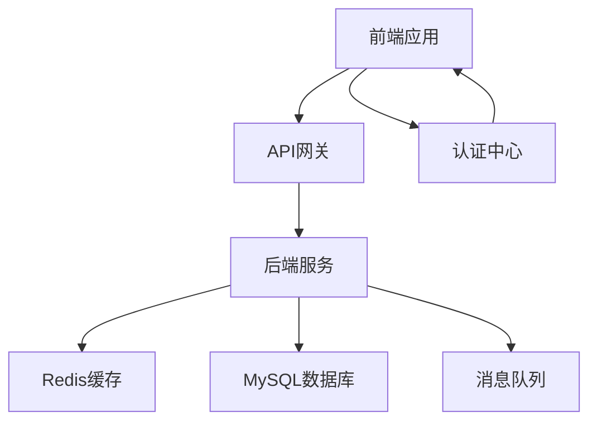

# Spring Boot + MyBatis-Plus + Vue3 通用开发脚手架技术架构设计

## 1. 架构概述

### 1.1 技术栈

| 分类 | 技术 | 版本 | 选型理由 |
| :--- | :--- | :--- | :--- |
| 后端框架 | Spring Boot | 3.2.x | 轻量级Java开发框架，简化配置，快速开发 |
| ORM框架 | MyBatis-Plus | 3.5.x | 增强MyBatis，提供代码生成、分页等功能 |
| 前端框架 | Vue | 3.x | 响应式前端框架，组件化开发 |
| 构建工具 | Maven | 3.8.x | Java项目标准构建工具 |
| 数据库 | MySQL | 8.0+ | 关系型数据库，稳定可靠 |
| 缓存 | Redis | 7.0+ | 高性能缓存，用于用户会话、权限缓存等 |
| 认证 | JWT | - | 无状态认证，便于水平扩展 |
| API文档 | Swagger3 | - | 自动生成API文档，便于前后端联调 |
| 容器化 | Docker | - | 应用容器化，简化部署 |
| 编排 | Kubernetes | - | 容器编排，实现高可用 |

### 1.2 架构图



**关键点：**
- **认证职责明确划分**：
    - **Gateway（认证网关）**：**集中负责认证（Authentication）**。**统一校验Token有效性（包括JWT解析、版本号校验、黑名单检查），并将解析后的用户身份信息（userId, roles）通过安全内部头透传给Backend**。Gateway**必须访问Redis**以完成上述校验。
    - **Backend（业务服务）**：**只负责授权（Authorization）**。**信任Gateway透传的身份信息，不再解析JWT**，专注于基于RBAC和数据权限的业务逻辑校验。
- Auth中心只负责登录、签发/刷新Token和登出（Token失效管理），不参与每次请求的实时校验。

### 1.2.1 服务间信任模型

**问题：**
- 如何防止绕过Gateway直接访问Backend？
- Header是否可以伪造？

**解决方案（强化版）：Gateway + IP白名单 + 内网隔离 + Internal Token**

**网络层防护（必须项）：**
- Backend服务部署在内网VPC中。
- **使用Kubernetes NetworkPolicy或云安全组，严格限制只允许Gateway所在网段的IP访问Backend服务端口**。这是防止伪造的第一道防线。

**IP白名单（应用层二次校验）：**
- Backend服务配置Gateway IP白名单。
- 仅允许白名单IP访问Backend接口。

**Internal Token增强（应用层身份校验）：**
1. **Gateway → Backend 请求头添加：**
```
X-Internal-Token: {signature}
X-Internal-User: {userId}
X-Internal-Role: {roleIds}
```
2. **Backend校验逻辑：**
```java
// 1. 校验来源IP是否在白名单内（第一道防线）
if (!isGatewayIp(request)) {
    throw new AccessDeniedException("非法请求来源");
}
// 2. 校验Internal Token签名（第二道防线）
String token = request.getHeader("X-Internal-Token");
String expectedSignature = calculateSignature(request, internalSecret);
if (!expectedSignature.equals(token)) {
    throw new AccessDeniedException("内部令牌无效");
}
// 3. 校验通过，信任并获取用户信息
```
3. **配置与安全管理：**
- `internal-secret` **通过环境变量或Kubernetes Secret注入，不得硬编码**。
- **建立secret轮换机制（如每季度或按需），并通过配置中心统一下发新secret**。
- **每个服务可配置独立的secret，增加安全性**。

## 2. 目录结构

### 2.1 后端目录结构

```
back/
├── common/                # 公共模块
│   ├── src/main/java/com/example/common/
│   │   ├── config/         # 配置类
│   │   ├── exception/      # 异常处理
│   │   ├── filter/         # 过滤器
│   │   ├── model/          # 公共模型
│   │   ├── utils/          # 工具类
│   │   └── validator/      # 数据验证
├── modules/
│   ├── system/             # 系统管理领域
│   │   ├── user/            # 用户管理
│   │   ├── role/            # 角色管理
│   │   ├── menu/            # 菜单管理
│   │   ├── dept/            # 部门管理
│   │   └── auth/            # 认证管理
│   ├── audit/              # 审计日志领域
│   ├── file/               # 文件管理领域
│   ├── message/            # 消息管理领域
│   └── ...
├── gateway/                # API网关
├── build.sh                # 构建脚本
└── pom.xml                 # Maven配置
```

**说明：**
- 按业务领域划分模块，更符合业务边界。
- 微服务拆分更自然。
- 每个领域内部按照标准分层结构组织代码。

**领域内部结构示例：**
```
system/user/
├── src/main/java/com/example/system/user/
│   ├── controller/  # 控制器
│   ├── entity/      # 实体类
│   ├── mapper/      # Mapper接口
│   ├── service/     # 服务层
│   ├── dto/         # 数据传输对象（请求/响应）
│   ├── vo/          # 视图对象（前端展示）
│   └── query/       # 查询对象（条件查询）
```

**DTO层细分与命名规范：**
- `dto/`：用于前后端数据传输。**建议请求对象命名为 `*Req`（如 `UserCreateReq`），响应对象命名为 `*Resp`（如 `UserResp`）**。
- `vo/`：用于前端展示，包含需要展示的字段。
- `query/`：用于条件查询，包含查询参数。

### 2.2 前端目录结构

#### 2.2.1 管理端 (front-admin)

```
front-admin/
├── public/                 # 静态资源
├── src/
│   ├── api/                # API请求
│   ├── assets/             # 静态资源
│   ├── components/         # 公共组件
│   ├── layout/             # 布局组件
│   ├── router/             # 路由配置
│   ├── store/              # 状态管理
│   ├── utils/              # 工具类
│   ├── views/              # 页面组件
│   ├── App.vue             # 根组件
│   └── main.js             # 入口文件
├── .env                    # 环境配置
├── .env.development        # 开发环境配置
├── .env.production         # 生产环境配置
├── package.json            # 依赖配置
└── vite.config.js          # Vite配置
```

#### 2.2.2 用户端 (front-user)

```
front-user/
├── public/                 # 静态资源
├── src/
│   ├── api/                # API请求
│   ├── assets/             # 静态资源
│   ├── components/         # 公共组件
│   ├── layout/             # 布局组件
│   ├── router/             # 路由配置
│   ├── store/              # 状态管理
│   ├── utils/              # 工具类
│   ├── views/              # 页面组件
│   ├── App.vue             # 根组件
│   └── main.js             # 入口文件
├── .env                    # 环境配置
├── .env.development        # 开发环境配置
├── .env.production         # 生产环境配置
├── package.json            # 依赖配置
└── vite.config.js          # Vite配置
```

## 3. 核心功能模块

### 3.1 用户中心 (User)

- 登录/登出
- 用户管理（CRUD）
- 用户状态控制（启用/禁用）
- 登录日志
- 对接企业统一认证（LDAP/OAuth2/SSO）

### 3.2 认证中心 (Auth)

- 登录认证（账号/SSO）
- Token签发（JWT）
- Token刷新
- 单点登录（SSO）
- 登录态管理（Redis）

**核心职责：**
- **只负责用户认证、Token签发/刷新和登出（将Token加入黑名单或更新版本号）**。
- **不参与请求的实时鉴权（实时鉴权由Gateway完成）**。
- 提供登录、登出、Token刷新接口。

**高可用设计：**

**水平扩展：**
- Auth服务设计为无状态，支持水平扩展。
- 部署多个Auth实例，通过Gateway负载均衡。
- 所有状态存储在Redis中。

**Redis集群化：**
- 使用Redis Cluster或Sentinel模式。
- 数据分片和高可用。
- 主从复制保障数据安全。

**登录限流保护：**
- 登录接口单独限流（如每分钟10次）。
- 验证码接口限流（如每分钟5次）。
- 同一IP登录失败次数限制。
- 失败超过阈值锁定账号（如15分钟）。

**性能优化：**
- 用户信息预热到Redis。
- 支持批量Token验证。
- 异步记录登录日志。

### 3.3 组织架构 (Org)

- 部门树结构
- 用户归属部门
- 审批流基础
- 数据权限基础

### 3.4 权限控制 (RBAC)

- 菜单权限
- 按钮权限
- API权限
- 数据权限

**统一权限模型：**
- Permission（权限）作为唯一权限源。
- Menu（菜单）、API、Button（按钮）都绑定到Permission。
- 权限结构：`用户 → 角色 → 权限 → 资源`。

### 3.5 审计日志 (Audit)

- 操作日志
- 登录日志
- 权限变更记录

### 3.6 系统配置 (Config)

- Feature Flag
- 动态参数
- 第三方配置

### 3.7 文件管理 (OSS)

- 文件上传（图片/合同）
- 文件访问控制

### 3.8 消息中心 (Message)

- 审批通知
- 系统通知
- 异步解耦

**技术选型：**
- RocketMQ（推荐）：事务消息支持好。
- Kafka：高吞吐，适合日志和大数据场景。

**使用场景：**
- 审计日志异步化。
- 系统通知推送。
- 数据同步。
- 业务解耦。

**消息一致性方案：**

**方案一：本地消息表（推荐，完善后）**
1. 业务操作 + 本地消息表写入（同一事务）。消息表需包含**状态字段（如：`sending`， `success`， `fail`）、重试次数、下次重试时间**。
2. 定时任务扫描本地消息表中状态为`sending`或重试时间已到的记录。
3. 发送消息到MQ。
4. 消费端**必须实现幂等处理**。
5. 发送成功，更新状态为`success`；达到最大重试次数仍失败，更新状态为`fail`并进入**死信队列或人工干预流程**。

### 3.9 定时任务 (Job)

- 定时同步
- 数据清理
- 报表生成

### 3.10 监控管理 (Monitor)

- 服务健康监控
- 性能监控
- 报警

## 4. 数据库设计

### 4.1 用户表 (sys_user)

| 字段名 | 数据类型 | 长度 | 约束 | 描述 |
| :--- | :--- | :--- | :--- | :--- |
| id | bigint | - | PRIMARY KEY | 用户ID |
| username | varchar | 50 | UNIQUE NOT NULL | 用户名 |
| password | varchar | 100 | NOT NULL | 密码（加密） |
| name | varchar | 50 | NOT NULL | 姓名 |
| email | varchar | 100 | UNIQUE | 邮箱 |
| phone | varchar | 20 | UNIQUE | 手机号 |
| dept_id | bigint | - | FOREIGN KEY | 部门ID |
| status | tinyint | 1 | NOT NULL DEFAULT 1 | 状态（1-启用，0-禁用） |
| deleted | tinyint | 1 | NOT NULL DEFAULT 0 | 软删除（0-未删除，1-已删除） |
| create_time | datetime | - | NOT NULL | 创建时间 |
| update_time | datetime | - | NOT NULL | 更新时间 |
| last_login_time | datetime | - | | 最后登录时间 |

### 4.2 部门表 (sys_dept)

| 字段名 | 数据类型 | 长度 | 约束 | 描述 |
| :--- | :--- | :--- | :--- | :--- |
| id | bigint | - | PRIMARY KEY | 部门ID |
| name | varchar | 50 | NOT NULL | 部门名称 |
| parent_id | bigint | - | FOREIGN KEY | 父部门ID |
| dept_code | varchar | 50 | UNIQUE | 部门编码 |
| leader | varchar | 50 | | 负责人 |
| order_num | int | - | NOT NULL DEFAULT 0 | 排序 |
| status | tinyint | 1 | NOT NULL DEFAULT 1 | 状态（1-启用，0-禁用） |
| ancestors | varchar | 500 | | 祖级路径，如：0,1,3,5 |
| create_time | datetime | - | NOT NULL | 创建时间 |
| update_time | datetime | - | NOT NULL | 更新时间 |

### 4.3 部门闭包表 (sys_dept_closure)

**设计目标：** 替代LIKE查询，提升查询性能，支持索引。

| 字段名 | 数据类型 | 长度 | 约束 | 描述 |
| :--- | :--- | :--- | :--- | :--- |
| id | bigint | - | PRIMARY KEY | 主键ID |
| ancestor_id | bigint | - | NOT NULL | 祖先部门ID |
| descendant_id | bigint | - | NOT NULL | 后代部门ID |
| distance | int | - | NOT NULL | 距离（0表示自己） |

**索引：**
```sql
INDEX idx_ancestor (ancestor_id)
INDEX idx_descendant (descendant_id)
INDEX idx_ancestor_descendant (ancestor_id, descendant_id)
```

**维护策略：**
- 新增部门时，自动维护闭包表。
- 更新部门父级时，重建闭包关系。
- 删除部门时，级联清理闭包表。
- 使用数据库触发器或应用层事务维护。

### 4.4 角色表 (sys_role)

| 字段名 | 数据类型 | 长度 | 约束 | 描述 |
| :--- | :--- | :--- | :--- | :--- |
| id | bigint | - | PRIMARY KEY | 角色ID |
| name | varchar | 50 | NOT NULL | 角色名称 |
| code | varchar | 50 | UNIQUE NOT NULL | 角色编码 |
| description | varchar | 200 | | 角色描述 |
| status | tinyint | 1 | NOT NULL DEFAULT 1 | 状态（1-启用，0-禁用） |
| create_time | datetime | - | NOT NULL | 创建时间 |
| update_time | datetime | - | NOT NULL | 更新时间 |

### 4.5 菜单表 (sys_menu)

| 字段名 | 数据类型 | 长度 | 约束 | 描述 |
| :--- | :--- | :--- | :--- | :--- |
| id | bigint | - | PRIMARY KEY | 菜单ID |
| name | varchar | 50 | NOT NULL | 菜单名称 |
| parent_id | bigint | - | FOREIGN KEY | 父菜单ID |
| path | varchar | 200 | | 路由路径 |
| component | varchar | 200 | | 组件路径 |
| permission_code | varchar | 100 | | 权限编码，关联sys_permission.code |
| type | tinyint | 1 | NOT NULL | 类型（0-目录，1-菜单，2-按钮） |
| icon | varchar | 50 | | 图标 |
| order_num | int | - | NOT NULL DEFAULT 0 | 排序 |
| status | tinyint | 1 | NOT NULL DEFAULT 1 | 状态（1-启用，0-禁用） |
| is_external | tinyint | 1 | NOT NULL DEFAULT 0 | 是否外部链接（0-否，1-是） |
| is_cache | tinyint | 1 | NOT NULL DEFAULT 0 | 是否缓存（0-否，1-是） |
| visible | tinyint | 1 | NOT NULL DEFAULT 1 | 是否可见（0-否，1-是） |
| create_time | datetime | - | NOT NULL | 创建时间 |
| update_time | datetime | - | NOT NULL | 更新时间 |

### 4.6 用户角色关联表 (sys_user_role)

| 字段名 | 数据类型 | 长度 | 约束 | 描述 |
| :--- | :--- | :--- | :--- | :--- |
| user_id | bigint | - | PRIMARY KEY | 用户ID |
| role_id | bigint | - | PRIMARY KEY | 角色ID |

**索引说明：**
- **联合主键 `(user_id, role_id)` 本身已是一个复合索引，支持 `WHERE user_id = ? AND role_id = ?` 的查询。**
- **如果业务中存在高频的 `WHERE user_id = ?` 查询（如查询用户所有角色），则保留 `INDEX idx_user_id (user_id)` 是合理的，因为它比复合索引更高效。**
- **如果存在高频的 `WHERE role_id = ?` 查询（如查询角色下的所有用户），则保留 `INDEX idx_role_id (role_id)` 是合理的。**
- **设计时应明确查询场景，避免创建冗余索引。**

### 4.7 权限表 (sys_permission)

| 字段名 | 数据类型 | 长度 | 约束 | 描述 |
| :--- | :--- | :--- | :--- | :--- |
| id | bigint | - | PRIMARY KEY | 权限ID |
| name | varchar | 50 | NOT NULL | 权限名称 |
| code | varchar | 100 | UNIQUE NOT NULL | 权限编码 |
| description | varchar | 200 | | 权限描述 |
| resource_type | varchar | 20 | NOT NULL | 资源类型（menu/button/api） |
| resource_id | bigint | - | | 资源ID |
| path | varchar | 200 | | API路径 |
| method | varchar | 10 | | 请求方法（GET/POST/PUT/DELETE） |
| status | tinyint | 1 | NOT NULL DEFAULT 1 | 状态（1-启用，0-禁用） |
| create_time | datetime | - | NOT NULL | 创建时间 |
| update_time | datetime | - | NOT NULL | 更新时间 |

**说明：**
- 权限表是唯一权限源。
- 菜单、按钮、API都通过permission_code关联到权限。
- 权限编码格式：`模块:操作`，如 `user:add`、`order:delete`。

### 4.8 角色权限关联表 (sys_role_permission)

| 字段名 | 数据类型 | 长度 | 约束 | 描述 |
| :--- | :--- | :--- | :--- | :--- |
| role_id | bigint | - | PRIMARY KEY | 角色ID |
| permission_id | bigint | - | PRIMARY KEY | 权限ID |

### 4.9 操作日志表 (sys_oper_log)

| 字段名 | 数据类型 | 长度 | 约束 | 描述 |
| :--- | :--- | :--- | :--- | :--- |
| id | bigint | - | PRIMARY KEY | 日志ID |
| title | varchar | 100 | NOT NULL | 操作标题 |
| business_type | int | - | NOT NULL | 业务类型 |
| method | varchar | 100 | NOT NULL | 方法名 |
| request_method | varchar | 10 | NOT NULL | 请求方式 |
| operator_type | int | - | NOT NULL | 操作类型 |
| oper_name | varchar | 50 | NOT NULL | 操作人 |
| dept_name | varchar | 50 | | 部门名称 |
| oper_url | varchar | 255 | | 操作URL |
| oper_ip | varchar | 128 | | 操作IP |
| oper_location | varchar | 255 | | 操作地点 |
| oper_param | text | - | | 操作参数 |
| json_result | text | - | | 返回结果 |
| status | int | - | NOT NULL DEFAULT 0 | 状态（0-成功，1-失败） |
| error_msg | text | - | | 错误信息 |
| oper_time | datetime | - | NOT NULL | 操作时间 |

### 4.10 登录日志表 (sys_login_log)

| 字段名 | 数据类型 | 长度 | 约束 | 描述 |
| :--- | :--- | :--- | :--- | :--- |
| id | bigint | - | PRIMARY KEY | 日志ID |
| username | varchar | 50 | NOT NULL | 用户名 |
| status | int | - | NOT NULL | 状态（0-成功，1-失败） |
| ipaddr | varchar | 128 | NOT NULL | 登录IP |
| login_location | varchar | 255 | | 登录地点 |
| browser | varchar | 50 | | 浏览器 |
| os | varchar | 50 | | 操作系统 |
| msg | varchar | 255 | | 登录信息 |
| login_time | datetime | - | NOT NULL | 登录时间 |

### 4.11 角色数据权限表 (sys_role_data_scope)

**原设计限制：** `role_id UNIQUE` 意味着一个角色全局只能有一种数据权限策略，无法满足“不同模块不同策略”的需求。

**修正后设计：**
| 字段名 | 数据类型 | 长度 | 约束 | 描述 |
| :--- | :--- | :--- | :--- | :--- |
| id | bigint | - | PRIMARY KEY | 主键ID |
| role_id | bigint | - | NOT NULL | 角色ID |
| module_code | varchar | 50 | NOT NULL | 模块编码（如：`order`, `user`） |
| scope_type | varchar | 20 | NOT NULL | 数据范围类型（ALL/DEPT/DEPT_AND_CHILD/SELF/CUSTOM） |
| create_time | datetime | - | NOT NULL | 创建时间 |
| update_time | datetime | - | NOT NULL | 更新时间 |

**索引：**
```sql
INDEX idx_role_module (role_id, module_code)
```
**说明：** 通过 `role_id + module_code` 联合唯一索引，支持一个角色在不同模块配置不同的数据权限策略。

### 4.12 角色部门关联表 (sys_role_dept)

| 字段名 | 数据类型 | 长度 | 约束 | 描述 |
| :--- | :--- | :--- | :--- | :--- |
| id | bigint | - | PRIMARY KEY | 主键ID |
| role_id | bigint | - | NOT NULL | 角色ID |
| dept_id | bigint | - | NOT NULL | 部门ID |

**索引：**
```sql
INDEX idx_role_id (role_id)
INDEX idx_dept_id (dept_id)
```

### 4.13 字段权限表 (sys_field_permission)

| 字段名 | 数据类型 | 长度 | 约束 | 描述 |
| :--- | :--- | :--- | :--- | :--- |
| id | bigint | - | PRIMARY KEY | 主键ID |
| role_id | bigint | - | NOT NULL | 角色ID |
| table_name | varchar | 100 | NOT NULL | 表名 |
| field_name | varchar | 100 | NOT NULL | 字段名 |
| permission_type | varchar | 20 | NOT NULL | 权限类型（visible/readonly/mask/hidden） |
| mask_rule | varchar | 200 | | 脱敏规则 |
| create_time | datetime | - | NOT NULL | 创建时间 |
| update_time | datetime | - | NOT NULL | 更新时间 |

**索引：**
```sql
INDEX idx_role_id (role_id)
INDEX idx_table_field (table_name, field_name)
```

## 5. 核心技术实现

### 5.1 认证与授权

- 使用 Spring Security + JWT 实现认证。
- 实现基于 RBAC 的权限控制。
- 支持细粒度的数据权限控制。

### 5.1.1 Token机制设计

**Token类型：**
- Access Token：短期（30分钟），用于API请求。
- Refresh Token：长期（7天），用于刷新Access Token。

**Token存储与刷新机制（修正后，统一模型）：**
**采用“后端自动刷新（Silent Refresh）”模型，前端不主动读取或管理Token。**
1. **存储**：Access Token和Refresh Token都存储在**HttpOnly Cookie**中，前端JavaScript无法直接访问，防止XSS攻击。
2. **请求**：前端发起请求时，浏览器自动携带Cookie。
3. **过期处理**：
    - Gateway校验Access Token过期时，**自动尝试使用Cookie中的Refresh Token向Auth中心发起刷新请求**。
    - 刷新成功，**Gateway将新的Access Token和Refresh Token设置到Cookie中**，并继续转发原始请求。
    - 刷新失败（Refresh Token也过期），Gateway返回**特定的认证失败状态码（如401）和标识**。
4. **前端响应**：前端拦截器捕获到401和“需重新登录”标识后，**跳转到登录页面**，而不是尝试调用刷新接口。

**安全机制：**
- Refresh Token设计为**只能使用一次**，刷新后立即失效，生成新的Refresh Token。
- Token黑名单/版本号机制由**Gateway在校验时统一处理**。

### 5.1.1.1 JWT撤销机制（版本号方案）

**问题：**
- JWT是无状态的 → 无法立即失效。
- 用户被封禁时Token仍然可用。
- 权限变更时Token仍然有效。

**解决方案：JWT + Redis版本号**

**Token结构：**
```json
{
  "userId": 1,
  "version": 3,
  "exp": 1712345678
}
```

**Redis存储：**
```
{env}:user:token:version:1 = 4
```

**验证流程（由Gateway执行）：**
1. 解析Token获取userId和version。
2. 从Redis读取`{env}:user:token:version:{userId}`。
3. 比较：`if (token.version != redis.version) → Token失效`。
4. 验证通过后，将用户身份信息透传给Backend。

**版本号更新场景：**
- 用户封禁：`redis.version++`。
- 权限变更：`redis.version++`。
- 强制下线：`redis.version++`。

**优势：**
- 支持立即失效。
- 支持批量失效。
- 性能开销小（一次Redis读）。

### 5.1.2 数据权限实现方式

**推荐方案：**
- AOP + SQL拼接（推荐）。
- 或 MyBatis拦截器自动追加条件。

**实现原理：**
1. 在查询方法上使用注解标记需要数据权限的方法。
2. 通过AOP拦截查询，获取当前用户的数据权限范围。
3. 解析权限规则，自动拼接到SQL WHERE条件中。

**SQL示例：**
```sql
-- ALL：全部数据
SELECT * FROM table_name WHERE 1=1

-- DEPT：本部门数据
SELECT * FROM table_name WHERE dept_id = #{currentDeptId}

-- DEPT_AND_CHILD：本部门及子部门数据（使用闭包表）
SELECT * FROM table_name WHERE dept_id IN (
    SELECT descendant_id FROM sys_dept_closure WHERE ancestor_id = #{currentDeptId}
)

-- SELF：仅本人数据
SELECT * FROM table_name WHERE create_by = #{currentUserId}

-- CUSTOM：自定义部门数据
SELECT * FROM table_name WHERE dept_id IN (
    SELECT dept_id FROM sys_role_dept WHERE role_id = #{currentRoleId}
)
```

**防SQL注入安全说明：**
- 必须使用MyBatis参数绑定（`#{param}`），**不能使用字符串拼接**。
- 支持使用MyBatis-Plus Wrapper进行安全的条件构建。

**MyBatis-Plus Wrapper示例：**
```java
public List<User> selectUserList(User user, DataScope scope) {
    LambdaQueryWrapper<User> wrapper = Wrappers.lambdaQuery();
    
    if (scope.getScopeType().equals("DEPT")) {
        wrapper.eq(User::getDeptId, scope.getCurrentDeptId());
    } else if (scope.getScopeType().equals("DEPT_AND_CHILD")) {
        // 使用 apply 方法进行安全的参数化SQL拼接
        wrapper.apply("dept_id IN (SELECT descendant_id FROM sys_dept_closure WHERE ancestor_id = {0})", 
                      scope.getCurrentDeptId());
    }
    
    return userMapper.selectList(wrapper);
}
```

**注解示例：**
```java
@DataScope(deptAlias = "t", userAlias = "t")
public List<User> selectUserList(User user) {
    return userMapper.selectUserList(user);
}
```

### 5.1.3 字段级权限控制

**分层处理方案（推荐）：**

| 层级   | 处理       |
| ---- | -------- |
| SQL  | 过滤数据（WHERE条件）     |
| Java | 字段控制（可见性、脱敏） |

**权限类型：**
- `visible`：可见。
- `readonly`：只读。
- `mask`：脱敏。
- `hidden`：隐藏。

**Java层处理方案（推荐，用于字段控制）：**

**实现原理：**
1. SQL层查询完整数据。
2. 通过AOP拦截返回结果。
3. 根据用户角色的字段权限配置进行字段级处理。
4. 对于脱敏字段，根据配置的脱敏规则进行处理。

**注解示例：**
```java
public class UserVO {
    private Long id;
    private String username;
    
    @FieldPermission(maskRule = "phone")
    private String phone;
    
    @FieldPermission(permissionType = "hidden")
    private BigDecimal amount;
    
    @FieldPermission(permissionType = "hidden")
    private String email;
}
```

**Java层处理实现：**
```java
@Aspect
@Component
public class FieldPermissionAspect {
    
    @Autowired
    private FieldPermissionService fieldPermissionService;
    
    @Around("@annotation(com.example.common.annotation.FieldPermission)")
    public Object around(ProceedingJoinPoint joinPoint) throws Throwable {
        Object result = joinPoint.proceed();
        
        if (result == null) {
            return null;
        }
        
        // 获取当前用户角色
        Set<Long> roleIds = SecurityUtils.getCurrentUserRoleIds();
        
        // 处理结果
        if (result instanceof Collection) {
            ((Collection<?>) result).forEach(item -> 
                processFieldPermissions(item, roleIds));
        } else {
            processFieldPermissions(result, roleIds);
        }
        
        return result;
    }
    
    private void processFieldPermissions(Object obj, Set<Long> roleIds) {
        if (obj == null) {
            return;
        }
        
        Class<?> clazz = obj.getClass();
        String tableName = camelToUnderline(clazz.getSimpleName());
        
        Field[] fields = clazz.getDeclaredFields();
        for (Field field : fields) {
            field.setAccessible(true);
            
            // 查询字段权限配置
            List<FieldPermission> permissions = fieldPermissionService
                .getPermissions(roleIds, tableName, field.getName());
            
            if (permissions.isEmpty()) {
                continue;
            }
            
            // 取最严格的权限
            FieldPermission strictest = getStrictestPermission(permissions);
            
            try {
                switch (strictest.getPermissionType()) {
                    case "hidden":
                        field.set(obj, null);
                        break;
                    case "mask":
                        String value = (String) field.get(obj);
                        field.set(obj, maskValue(value, strictest.getMaskRule()));
                        break;
                    case "visible":
                    case "readonly":
                    default:
                        // 保持原样
                        break;
                }
            } catch (IllegalAccessException e) {
                // 日志记录
            }
        }
    }
    
    private String maskValue(String value, String rule) {
        if (value == null) {
            return null;
        }
        if ("phone".equals(rule) && value.length() >= 11) {
            return value.substring(0, 3) + "****" + value.substring(7);
        }
        if ("idcard".equals(rule) && value.length() >= 18) {
            return value.substring(0, 6) + "********" + value.substring(14);
        }
        if ("email".equals(rule)) {
            int atIndex = value.indexOf('@');
            if (atIndex > 2) {
                return value.substring(0, 2) + "***" + value.substring(atIndex);
            }
        }
        return value;
    }
    
    private String camelToUnderline(String str) {
        // 驼峰转下划线
        return str.replaceAll("([a-z])([A-Z])", "$1_$2").toLowerCase();
    }
    
    private FieldPermission getStrictestPermission(List<FieldPermission> permissions) {
        // 权限优先级：hidden > mask > readonly > visible
        Map<String, Integer> priority = Map.of(
            "hidden", 4,
            "mask", 3,
            "readonly", 2,
            "visible", 1
        );
        return permissions.stream()
            .max(Comparator.comparingInt(p -> priority.getOrDefault(p.getPermissionType(), 0)))
            .orElse(null);
    }
}
```

### 5.2 缓存机制

- 使用 Redis 缓存用户信息、权限信息等。
- 实现缓存一致性策略。

### 5.2.1 Redis使用规范

**使用场景：**
- 用户信息缓存（TTL）。
- 权限缓存（登录时加载）。
- Token黑名单/版本号（由Gateway使用）。

**权限加载策略（多级缓存）：**

**一级缓存：Caffeine（JVM本地缓存）**
- 高性能本地缓存。
- 减少Redis访问压力。
- TTL设置较短（如5分钟）。

**二级缓存：Redis**
- 分布式共享缓存。
- TTL设置较长（如30分钟）。

**缓存加载流程：**
1. 请求先查一级缓存（Caffeine）。
2. 一级缓存未命中 → 查二级缓存（Redis）。
3. 二级缓存未命中 → 查数据库。
4. 数据库查询结果 → 回写二级缓存 → 回写一级缓存。

**缓存更新策略：**
- 更新数据库 → 删除缓存（而不是更新缓存）。
- 权限变更 → 删除Redis缓存 → 广播清除所有节点Caffeine缓存。
- 使用Redis Pub/Sub广播缓存失效事件。

**缓存策略：**
1. **用户信息**：设置合理的TTL，如30分钟。
2. **权限信息**：登录时加载，登出时清理。

### 5.2.2 Redis Key设计规范

**Key命名规则：**
```
{env}:{业务模块}:{数据类型}:{唯一标识}
```
**其中 `{env}` 为环境标识（如 `dev`, `test`, `prod`），用于环境隔离。**

**示例：**
- 用户信息：`prod:user:info:{userId}`
- 用户权限：`prod:user:perm:{userId}`
- Token版本号：`prod:user:token:version:{userId}`
- 系统配置：`prod:system:config:{key}`

**Key前缀统一管理：**
- 使用常量类管理所有Key前缀。
- 避免硬编码。

### 5.2.3 缓存防护策略

**缓存穿透：**
- 空值缓存：对不存在的数据也进行缓存，设置较短TTL（如5分钟）。
- 布隆过滤器：对热点数据进行预过滤。

**缓存击穿：**
- 分布式锁：使用Redis分布式锁防止缓存击穿。
- 热点数据预热：提前加载热点数据到缓存。

**缓存雪崩：**
- TTL随机化：在基础TTL上添加随机值（如±10%）。
- 分层缓存：使用多级缓存策略。
- 缓存预热：系统启动时预热缓存。

### 5.3 日志系统

- 使用 ELK 或 EFK 实现日志集中化。
- 实现 traceId 贯穿整个调用链。

### 5.3.1 traceId与spanId设计

- traceId（链路ID）：唯一标识一次完整请求链路。
- spanId（调用节点ID）：标识链路中的单个服务或方法调用。

**实现：**
1. 网关层使用过滤器生成唯一的 traceId 和 spanId。
2. 将 traceId 和 spanId 添加到请求头中（如 `X-Trace-Id`、`X-Span-Id`）。
3. 服务间调用时，保持 traceId 不变，生成新的 spanId。
4. 所有服务通过拦截器获取并传递 traceId 和 spanId。
5. 日志框架配置为自动打印 traceId 和 spanId。
6. ELK 索引 traceId 和 spanId 字段，便于链路追踪。

### 5.4 监控系统

- 使用 Prometheus + Grafana 实现服务监控。
- 使用 SkyWalking 实现链路追踪。

### 5.5 代码生成

- 基于 MyBatis-Plus Generator 实现代码生成。
- 支持自定义模板。

### 5.6 服务间调用安全

**方案：**
- Feign拦截器传递Gateway下发的内部身份信息（X-Internal-User, X-Internal-Role）。
- 或使用Service Mesh（Istio）自动处理。

### 5.7 幂等设计

**问题：**
- 防重复提交。
- MQ重复消费。
- 高并发场景下的幂等控制。

**方案：幂等Key + Redis SETNX**

**幂等Key生成规则：**
```
幂等Key = {env}:{userId}:{businessType}:{requestId}
```
**其中 `requestId` 必须保证唯一性，建议由前端生成UUID或使用雪花算法，或对请求体关键部分进行Hash。**

**Redis实现：**
```java
// 设置幂等Key，5秒过期
Boolean success = redisTemplate.opsForValue().setIfAbsent(key, "1", 5, TimeUnit.SECONDS);

if (success) {
    // 首次请求，执行业务
    try {
        doBusiness();
        return Result.success();
    } finally {
        // 业务执行完成后删除Key（可选，根据业务场景）
        redisTemplate.delete(key);
    }
} else {
    // 重复请求，直接返回
    return Result.success("请勿重复提交");
}
```

**应用场景：**
- 支付操作。
- 提交订单。
- 审批流程。
- 数据导入。
- MQ消费。

### 5.8 限流策略（Gateway）

**限流目标：**
- 按IP限流。
- 按用户限流。
- 接口级限流（如登录接口）。

**技术方案：**
- Redis + Token Bucket。
- Spring Cloud Gateway + Redis RateLimiter。

**限流规则：**
1. **IP限流**：每个IP每分钟最多100次请求。
2. **用户限流**：每个用户每分钟最多200次请求。
3. **接口限流**：登录接口每分钟最多10次，验证码接口每分钟最多5次。
4. **限流响应**：返回429状态码，提示“请求过于频繁，请稍后再试”。

### 5.8 降级与熔断机制

**降级策略：**
- 限流降级：当请求超过限流阈值时，返回友好的降级响应。
- 服务降级：当下游服务不可用时，返回缓存数据或默认值。

**熔断机制：**
- 使用Sentinel或Resilience4j实现熔断。
- 熔断触发条件：失败率、响应时间、异常比例。
- 熔断状态：闭合 → 半开 → 全开 → 闭合。

## 6. 容器化部署

### 6.1 Docker 配置

#### 6.1.1 后端服务 Dockerfile

```dockerfile
FROM openjdk:17-jdk-slim

WORKDIR /app

COPY target/*.jar app.jar

EXPOSE 8080

ENTRYPOINT ["java", "-jar", "app.jar"]
```

#### 6.1.2 前端服务 Dockerfile

```dockerfile
FROM node:16-alpine as build

WORKDIR /app

COPY package*.json ./

RUN npm install

COPY . .

RUN npm run build

FROM nginx:alpine

COPY --from=build /app/dist /usr/share/nginx/html

COPY nginx.conf /etc/nginx/nginx.conf

EXPOSE 80

CMD ["nginx", "-g", "daemon off;"]
```

### 6.2 Kubernetes 配置

#### 6.2.1 后端服务 Deployment

```yaml
apiVersion: apps/v1
kind: Deployment
metadata:
  name: backend
  labels:
    app: backend
spec:
  replicas: 3
  selector:
    matchLabels:
      app: backend
  template:
    metadata:
      labels:
        app: backend
    spec:
      containers:
      - name: backend
        image: backend:latest
        ports:
        - containerPort: 8080
        env:
        - name: SPRING_PROFILES_ACTIVE
          value: prod
        - name: DB_HOST
          value: mysql
        - name: REDIS_HOST
          value: redis
        resources:
          requests:
            cpu: "500m"
            memory: "512Mi"
          limits:
            cpu: "1"
            memory: "1Gi"
```

#### 6.2.2 前端服务 Deployment

```yaml
apiVersion: apps/v1
kind: Deployment
metadata:
  name: front-admin
  labels:
    app: front-admin
spec:
  replicas: 2
  selector:
    matchLabels:
      app: front-admin
  template:
    metadata:
      labels:
        app: front-admin
    spec:
      containers:
      - name: front-admin
        image: front-admin:latest
        ports:
        - containerPort: 80
        resources:
          requests:
            cpu: "200m"
            memory: "256Mi"
          limits:
            cpu: "500m"
            memory: "512Mi"
---
apiVersion: apps/v1
kind: Deployment
metadata:
  name: front-user
  labels:
    app: front-user
spec:
  replicas: 2
  selector:
    matchLabels:
      app: front-user
  template:
    metadata:
      labels:
        app: front-user
    spec:
      containers:
      - name: front-user
        image: front-user:latest
        ports:
        - containerPort: 80
        resources:
          requests:
            cpu: "200m"
            memory: "256Mi"
          limits:
            cpu: "500m"
            memory: "512Mi"
```

#### 6.2.3 Service 配置

```yaml
apiVersion: v1
kind: Service
metadata:
  name: backend
  labels:
    app: backend
spec:
  selector:
    app: backend
  ports:
  - port: 8080
    targetPort: 8080
---
apiVersion: v1
kind: Service
metadata:
  name: front-admin
  labels:
    app: front-admin
spec:
  selector:
    app: front-admin
  ports:
  - port: 80
    targetPort: 80
  type: NodePort
---
apiVersion: v1
kind: Service
metadata:
  name: front-user
  labels:
    app: front-user
spec:
  selector:
    app: front-user
  ports:
  - port: 80
    targetPort: 80
  type: NodePort
```

#### 6.2.4 Ingress 配置

```yaml
apiVersion: networking.k8s.io/v1
kind: Ingress
metadata:
  name: app-ingress
  annotations:
    nginx.ingress.kubernetes.io/rewrite-target: /
spec:
  rules:
  - host: example.com
    http:
      paths:
      - path: /api
        pathType: Prefix
        backend:
          service:
            name: backend
            port:
              number: 8080
      - path: /admin
        pathType: Prefix
        backend:
          service:
            name: front-admin
            port:
              number: 80
      - path: /
        pathType: Prefix
        backend:
          service:
            name: front-user
            port:
              number: 80
```

#### 6.2.5 ConfigMap 配置

```yaml
apiVersion: v1
kind: ConfigMap
metadata:
  name: app-config
data:
  SPRING_PROFILES_ACTIVE: "prod"
  LOG_LEVEL: "INFO"
  application.yml: |
    spring:
      datasource:
        url: jdbc:mysql://mysql:3306/app_db
        driver-class-name: com.mysql.cj.jdbc.Driver
      redis:
        host: redis
        port: 6379
```

#### 6.2.6 Secret 配置

```yaml
apiVersion: v1
kind: Secret
metadata:
  name: app-secret
type: Opaque
stringData:
  DB_USERNAME: "app_user"
  DB_PASSWORD: "your_password_here"
  JWT_SECRET: "your_jwt_secret_here"
  INTERNAL_SECRET: "your_internal_secret_here"
  REDIS_PASSWORD: "your_redis_password_here"
```

#### 6.2.7 HPA（自动扩缩容）配置

```yaml
apiVersion: autoscaling/v2
kind: HorizontalPodAutoscaler
metadata:
  name: backend-hpa
spec:
  scaleTargetRef:
    apiVersion: apps/v1
    kind: Deployment
    name: backend
  minReplicas: 2
  maxReplicas: 10
  metrics:
  - type: Resource
    resource:
      name: cpu
      target:
        type: Utilization
        averageUtilization: 70
  - type: Resource
    resource:
      name: memory
      target:
        type: Utilization
        averageUtilization: 80
```

## 7. 开发与部署流程

### 7.1 开发流程

1. 代码拉取与环境搭建。
2. 数据库初始化。
3. 后端服务开发。
4. 前端服务开发。
5. 本地测试。
6. 代码提交与CI/CD。

### 7.2 部署流程

1. 代码构建。
2. 镜像构建与推送。
3. Kubernetes 部署。
4. 服务监控与日志查看。

## 8. 扩展性考虑

### 8.1 架构演进路径

#### 8.1.1 当前架构：Modular Monolith（模块化单体）

**当前状态：**
- 按业务领域划分模块（modules/system/user、modules/system/role等）。
- 本质是模块化单体应用（Modular Monolith）。
- 共享数据库、共享部署。
- 这**不是问题，反而是优点**。

**Modular Monolith的优势：**
- 开发效率高，无需处理分布式事务。
- 部署简单，运维成本低。
- 调试方便，问题定位快速。
- 适合中小团队和初期项目。

**适用场景：**
- 团队规模 < 20人。
- 业务复杂度中等。
- 日活用户 < 100万。
- QPS < 1万。

---

#### 8.1.2 微服务拆分前提

**必须满足以下全部条件才考虑拆分微服务：**

| 条件 | 说明 |
|------|------|
| 独立数据库 | 每个微服务有自己的独立数据库 |
| 独立部署 | 每个微服务可以独立部署和扩缩容 |
| 独立团队 | 每个微服务有独立的开发团队维护 |
| 业务边界清晰 | 业务领域边界清晰，耦合度低 |
| 性能瓶颈 | 单体架构已无法满足性能要求 |

**如果不满足以上条件：**
- ❌ 不要强行拆分微服务。
- ✅ 继续使用Modular Monolith。
- ✅ 优化单体架构性能。

---

#### 8.1.3 微服务拆分策略

**当满足拆分条件时，按以下策略拆分：**

**拆分原则：**
- 按业务域拆分（Domain-Driven Design）。
- 单一职责原则。
- 高内聚、低耦合。

**推荐拆分方案：**

| 微服务 | 职责 | 数据库 |
|--------|------|--------|
| user-service | 用户管理、认证授权 | user_db |
| org-service | 组织架构、部门管理 | org_db |
| permission-service | 权限管理、角色管理 | permission_db |
| audit-service | 审计日志、操作日志 | audit_db |
| file-service | 文件上传、文件管理 | file_db |
| message-service | 消息通知、消息队列 | message_db |

**技术栈：**
- Spring Cloud Alibaba（推荐）。
- 或 Spring Cloud Netflix。
- Service Mesh：Istio/Linkerd。

### 8.2 多环境支持

- 开发环境。
- 测试环境。
- 预生产环境。
- 生产环境。

## 9. 安全考虑

### 9.1 后端安全

- 接口鉴权。
- SQL注入防护。
- XSS防护。
- CSRF防护。
- 敏感信息加密。

### 9.2 前端安全

- 前端权限控制。
- 输入验证。
- 防止XSS攻击。
- 敏感信息保护。

## 10. 统一异常码体系

### 10.1 异常码设计原则

- **唯一性**：每个异常码唯一标识一种错误类型。
- **可读性**：异常码结构清晰，便于理解。
- **可扩展性**：预留足够的扩展空间。
- **语义化**：异常码能够反映错误的大致类型和模块。

### 10.2 异常码结构

```
{模块编码}{错误类型}{具体错误}
```

- **模块编码**：2位数字，标识业务模块。
- **错误类型**：2位数字，标识错误类型。
- **具体错误**：3位数字，标识具体错误。

### 10.3 异常码分类

**模块编码：**
- 00：通用。
- 01：用户模块。
- 02：权限模块。
- 03：认证模块。
- 04：组织架构。
- 05：系统配置。
- 06：文件管理。
- 07：消息中心。
- 08：审计日志。
- 09：定时任务。

**错误类型：**
- 01：参数错误。
- 02：业务错误。
- 03：系统错误。
- 04：权限错误。
- 05：资源错误。
- 06：网络错误。

### 10.4 示例异常码

| 异常码 | 描述 | HTTP状态码 |
| :--- | :--- | :--- |
| 0001001 | 请求参数无效 | 400 |
| 0002001 | 业务逻辑错误 | 400 |
| 0003001 | 系统内部错误 | 500 |
| 0101001 | 用户名格式错误 | 400 |
| 0104001 | 用户无权限 | 403 |
| 0204001 | 角色权限不足 | 403 |
| 0301001 | 登录参数错误 | 400 |
| 0304001 | Token过期 | 401 |

### 10.5 异常处理流程

1. **捕获异常**：统一捕获系统中的异常。
2. **转换异常**：将异常转换为标准的异常码和错误信息。
3. **返回响应**：返回包含异常码、错误信息的标准响应格式。
4. **记录日志**：记录异常详情，便于排查。

### 10.6 前端异常处理

- 统一处理后端返回的异常码。
- 根据异常码显示对应的错误提示。
- 对不同类型的异常进行不同的处理策略。
- 记录前端错误日志，便于问题排查。

## 11. 统一响应结构

### 11.1 标准响应格式

**成功响应：**
```json
{
  "code": "0",
  "message": "success",
  "data": {},
  "traceId": "abc123xyz456"
}
```

**错误响应：**
```json
{
  "code": "0104001",
  "message": "用户无权限",
  "data": null,
  "traceId": "abc123xyz456"
}
```

**字段说明：**
- `code`：响应码（0表示成功，其他表示错误）。
- `message`：响应消息。
- `data`：响应数据（成功时返回业务数据，失败时为null）。
- `traceId`：链路追踪ID，用于问题排查。

### 11.2 响应码约定

- 成功："0"。
- 错误：使用统一异常码体系（见第10章）。

### 11.3 拦截器配置

- 所有响应统一通过拦截器封装。
- 自动从MDC获取traceId并添加到响应中。
- 统一异常处理，将异常转换为标准错误响应。

## 12. 可观测性设计

### 12.1 日志结构设计

**标准日志格式（JSON）：**
```json
{
  "timestamp": "2024-01-01T12:00:00.000Z",
  "level": "INFO",
  "logger": "com.example.UserController",
  "message": "用户查询成功",
  "traceId": "abc123xyz456",
  "spanId": "def789",
  "userId": "123",
  "uri": "/api/user/list",
  "method": "GET",
  "cost": 123,
  "status": 200
}
```

**必需字段：**
- `traceId`：链路追踪ID。
- `spanId`：调用节点ID。
- `userId`：用户ID（如适用）。
- `uri`：请求URI。
- `cost`：耗时（毫秒）。
- `status`：响应状态码。

### 12.2 核心指标体系

**应用指标：**
- QPS（每秒查询数）。
- RT（响应时间）：P50、P95、P99。
- Error Rate（错误率）。
- 并发数。

**业务指标：**
- 登录成功率。
- 订单成功率。
- 消息投递成功率。

**系统指标：**
- CPU使用率。
- 内存使用率。
- 磁盘使用率。
- 网络流量。

### 12.3 告警规则

**错误类告警：**
- 错误率 > 5%，持续5分钟。
- 5xx错误 > 10次/分钟。
- 4xx错误 > 100次/分钟。

**性能类告警：**
- RT(P95) > 2秒，持续5分钟。
- RT(P99) > 5秒，持续5分钟。
- QPS下降 > 50%，持续5分钟。

**系统类告警：**
- CPU使用率 > 80%，持续10分钟。
- 内存使用率 > 85%，持续10分钟。
- 磁盘使用率 > 90%。

### 12.4 Trace规范

**TraceID生成：**
- 使用UUID或Snowflake算法生成。
- 全局唯一。

**SpanID生成：**
- 每次调用生成新的SpanID。
- 父子关系通过ParentSpanID维护。

**传递方式：**
- HTTP Header：`X-Trace-Id`、`X-Span-Id`、`X-Parent-Span-Id`。
- MQ Header：统一传递Trace上下文。
- 线程池：传递Trace上下文到异步线程。

**采样策略：**
- 全量采样：测试环境。
- 概率采样：生产环境（如10%）。
- 错误采样：所有错误请求全量采样。
